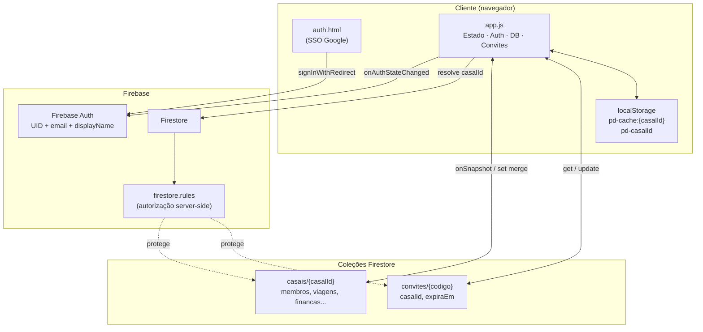
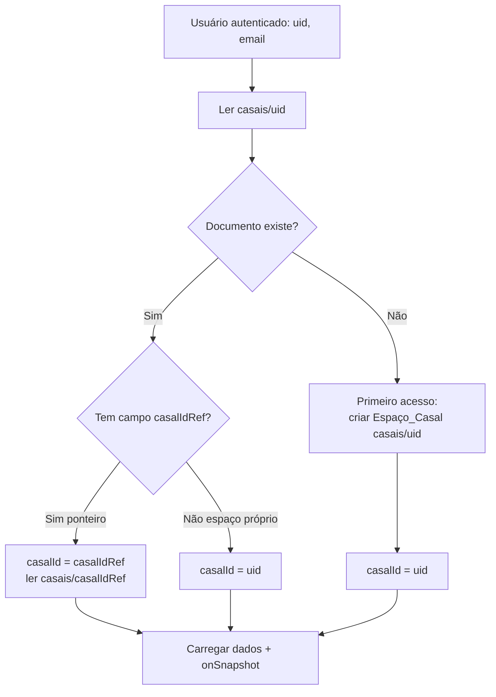
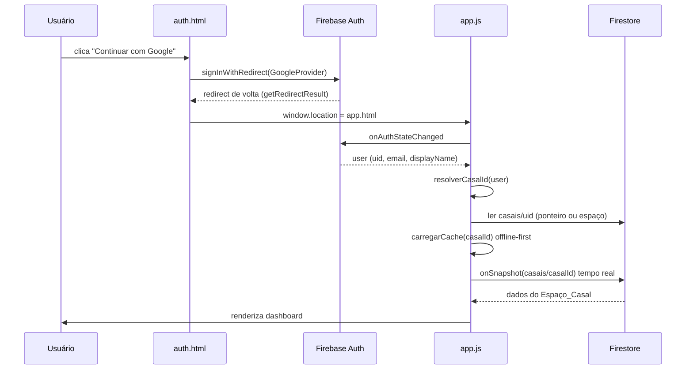
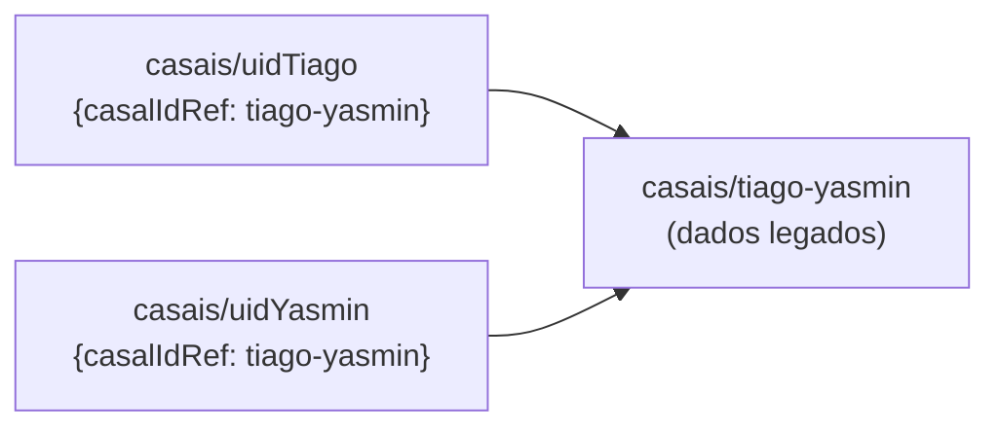

# Design Document — Multi-usuário SSO

## Overview

Esta feature converte o PlannerDuo de um sistema de documento único fixo (`casais/tiago-yasmin`, nomes `Tiago`/`Yasmin` hard-coded) para um sistema multi-usuário genérico. Cada Usuário autenticado via SSO Google obtém — ou cria — um **Espaço_Casal** isolado, identificado pelo UID do Criador. Um segundo Usuário ingressa nesse espaço por meio de um **Convite** com Código de 8 caracteres e validade de 72 horas. A autorização de acesso passa a ser garantida server-side pelas **Regras_Firestore**, que verificam se o e-mail do token de autenticação consta no mapa `membros` do documento.

O design preserva os três princípios operacionais do produto: offline-first (cache local carrega antes do Firestore), tempo real (`onSnapshot`) e não-travamento (erros Firestore são silenciosos). A única mudança conceitual profunda é que o identificador do documento deixa de ser uma constante e passa a ser **resolvido dinamicamente** a partir da identidade do Usuário logado.

### Objetivos de design

- Remover toda referência literal a `tiago-yasmin`, `Tiago`, `Yasmin`.
- Resolver o `casalId` de forma determinística a partir do UID/e-mail do Usuário.
- Introduzir fluxo de convite/aceite com validações completas.
- Mover a verificação de autorização para as Regras_Firestore usando `request.auth.token.email`.
- Preservar o documento legado e oferecer migração.

### Restrições herdadas do stack

- Firebase SDK **v8** (namespaced API — `firebase.firestore()`, `.collection().doc()`). O design mantém a v8 para não reescrever todo o `app.js`.
- Sem backend próprio: não há Cloud Functions no projeto atual. Toda a lógica roda no cliente, exceto a autorização, que é feita pelas Regras_Firestore. Isso impõe uma decisão de design importante sobre o fluxo de convite (ver Decisão D4).

## Architecture

### Componentes de alto nível



### Resolução do Espaço_Casal (decisão central)

O maior desafio arquitetural é: dado um Usuário autenticado (UID + e-mail), **qual documento `casais/{id}` ele deve carregar?** Há dois casos:

1. O Usuário é **Criador** → o documento tem ID igual ao seu UID (`casais/{uid}`). Leitura direta por ID.
2. O Usuário é **Parceiro** (entrou por convite) → o documento tem ID = UID de *outra* pessoa. Seu e-mail está no mapa `membros`, mas ele não conhece o ID diretamente.

**Decisão D1 — Ponteiro de associação por UID.** Para o caso 2 sem exigir uma query `where('membros.email', ...)` (que o Firestore não suporta em maps arbitrários sem index e que colidiria com as regras de segurança de leitura restrita), guardamos um documento-ponteiro leve `casais/{uid}` mesmo para o Parceiro, contendo apenas `{ casalIdRef: '<uid-do-criador>' }`. Assim, **todo Usuário sempre lê primeiro `casais/{seu-uid}`**:

- Se o doc tem dados completos (`membros`, `financas`, ...) → é o próprio Espaço_Casal.
- Se o doc tem apenas `casalIdRef` → redireciona a leitura para `casais/{casalIdRef}`.
- Se o doc não existe → primeiro acesso, cria um novo Espaço_Casal.

Isso mantém toda resolução como leitura por ID (compatível com regras restritas) e evita queries de coleção.



### Fluxo de autenticação e entrada no app



## Components and Interfaces

As mudanças concentram-se em `app.js` (objetos `Estado`, `Auth`, `DB` e um novo objeto `Convites`), em `auth.html` (nenhuma mudança de lógica de login, apenas remoção de textos fixos) e em `firestore.rules`.

### `Estado` (modificado)

Remove os fallbacks fixos `nome1:'Tiago'`/`nome2:'Yasmin'` e adiciona `casalId`.

```js
const Estado = {
  usuarioUid: null,
  usuarioEmail: null,
  usuarioNome: null,       // displayName do Google
  casalId: null,           // NOVO — resolvido dinamicamente
  nomeUsuario: null,
  nome1: null,             // sem fallback fixo (null até carregar)
  nome2: null,
  viagens: [], financas: [], metas: [], checklist: [],
  unsubscribe: null
};
```

### `Auth` (modificado)

| Método | Mudança |
|--------|---------|
| `iniciarObserver` | inalterado no roteamento; ao entrar no app chama `resolverCasalId` antes de `_entrarNoApp` |
| `resolverCasalId(user)` | **NOVO** — implementa o fluxo da Decisão D1; retorna o `casalId` e grava em `Estado.casalId` e em `localStorage['pd-casalId']` |
| `_criarEspacoCasal(user)` | substitui `_criarDocCasal`; cria `casais/{uid}` com `membros:{ [email]: displayName }`, nome1 = displayName, nome2 = null |
| `_bloquear` | mensagem genérica de "Acesso não autorizado" sem nomes próprios (Req 3.4) |
| `logout` | remove `pd-cache:{casalId}` e `pd-casalId` (Req 7.4) |

```js
// Assinatura conceitual
Auth.resolverCasalId = async (user) => {
  const meuDoc = await db.collection('casais').doc(user.uid).get();
  if (!meuDoc.exists) { await Auth._criarEspacoCasal(user); return user.uid; }
  const data = meuDoc.data();
  return data.casalIdRef || user.uid;
};
```

### `DB` (modificado)

Todas as chamadas trocam `CASAL_DOC_ID` por `Estado.casalId`. A chave de cache passa a ser derivada:

| Método | Mudança |
|--------|---------|
| `chaveCache()` | **NOVO** — retorna `` `pd-cache:${Estado.casalId}` `` (Req 2.6, 7.1) |
| `carregarCache` | lê de `chaveCache()` |
| `ouvirNuvem` | `onSnapshot(casais/{Estado.casalId})`; grava cache em `chaveCache()` |
| `salvar` / `salvarVarios` | `set(casais/{Estado.casalId}, ..., {merge:true})` |
| `_criarDocInicial` | removido (criação passa a ser responsabilidade de `Auth._criarEspacoCasal`) |

### `Convites` (novo objeto)

```js
const Convites = {
  gerarCodigo(),            // → string A-Z0-9 de 8 chars
  criar(),                  // cria convites/{codigo} p/ Estado.casalId, expira +72h
  abrirModal(),             // exibe o código gerado ao Membro
  aceitar(codigo),          // valida e ingressa o usuário no Espaço_Casal
};
```

Regras de validação em `Convites.aceitar` (Req 4.6–4.9), avaliadas nesta ordem:

1. Convite inexistente → erro "código inválido".
2. `expiraEm < agora` → erro "código expirou".
3. `Object.keys(membros).length >= 2` → erro "espaço do casal está cheio".
4. `membros[email]` já existe → erro "você já é membro".
5. Caso contrário → adiciona `membros[email] = displayName`, grava ponteiro `casais/{meuUid} = { casalIdRef }`, re-resolve e recarrega.

### Novo modal de convite (`app.html`)

Dois modais adicionados ao `app.html`:

- `modal-convite-gerar`: botão "Gerar código", exibe o código de 8 chars + botão copiar + validade.
- `modal-convite-aceitar`: input de 8 chars + botão "Entrar no espaço".

Um item de menu/ação na sidebar ("Convidar parceiro(a)") abre o modal apropriado conforme o número de membros atuais.

### `firestore.rules` (reescrito)

```
rules_version = '2';
service cloud.firestore {
  match /databases/{database}/documents {

    function autenticado() { return request.auth != null; }
    function emailAuth()   { return request.auth.token.email; }

    // Espaço_Casal
    match /casais/{casalId} {
      // Ponteiro leve: doc cujo id == uid e que só tem casalIdRef
      function ehPonteiro() {
        return request.resource.data.keys().hasOnly(['casalIdRef']);
      }
      function souMembro() {
        return autenticado()
          && resource.data.membros != null
          && emailAuth() in resource.data.membros;
      }
      // Criação: só o dono do uid pode criar seu doc (espaço ou ponteiro)
      allow create: if autenticado() && casalId == request.auth.uid;
      // Leitura/escrita do espaço: apenas membros já registrados
      allow read, write: if souMembro();
      // Permitir ao próprio dono ler/escrever seu ponteiro
      allow read, write: if autenticado() && casalId == request.auth.uid;
    }

    // Convites
    match /convites/{codigo} {
      // Qualquer autenticado pode ler um convite (para tentar ingressar)
      allow get: if autenticado();
      // Criar convite: autenticado (o app garante que é membro do casalId gravado)
      allow create: if autenticado();
      allow delete: if autenticado();
    }

    // Bloqueia todo o resto
    match /{document=**} { allow read, write: if false; }
  }
}
```

**Decisão D2 — `request.auth.token.email` como chave de autorização.** As regras usam o e-mail do token (`request.auth.token.email`) em vez do UID porque o mapa `membros` é indexado por e-mail (é o identificador que o Criador conhece e digita/compartilha). O e-mail no token Google é verificado pelo provedor, portanto confiável para autorização. Isso atende Req 5.1–5.6: a leitura/escrita do espaço exige `emailAuth() in resource.data.membros`, e um mapa ausente ou vazio faz `souMembro()` retornar falso (Req 5.6).

## Data Models

### Coleção `casais`

Documento pode assumir uma de duas formas.

**Forma A — Espaço_Casal completo** (`casais/{uidDoCriador}`):

```json
{
  "nome1": "Ana",
  "nome2": "Bruno",
  "membros": {
    "ana@gmail.com": "Ana",
    "bruno@gmail.com": "Bruno"
  },
  "viagens":   [ { "id": "...", "destino": "...", "ida": "2025-01-01", "...": "..." } ],
  "financas":  [ { "id": "...", "tipo": "despesa", "valor": 0, "...": "..." } ],
  "metas":     [ { "id": "...", "titulo": "...", "alvo": 0, "...": "..." } ],
  "checklist": [ { "id": "...", "texto": "...", "feito": false } ],
  "criadoEm":  "2025-01-01T12:00:00.000Z"
}
```

**Forma B — Ponteiro** (`casais/{uidDoParceiro}`):

```json
{ "casalIdRef": "<uid-do-criador>" }
```

Restrição de tamanho: `membros` tem no máximo 2 chaves (imposto pela lógica de aceite de convite, Req 4.8). O documento inteiro deve respeitar o limite de 1 MiB do Firestore — as listas (`viagens`, `financas`...) crescem inline; isso é uma limitação herdada do modelo atual, mantida por compatibilidade.

### Coleção `convites`

Documento `convites/{codigo}` onde `{codigo}` é o próprio Código de 8 caracteres:

```json
{
  "casalId": "<uid-do-criador>",
  "criadoPor": "ana@gmail.com",
  "criadoEm": "2025-01-01T12:00:00.000Z",
  "expiraEm": "2025-01-04T12:00:00.000Z"
}
```

- `codigo` (ID): 8 caracteres, alfabeto `A-Z0-9` (36 símbolos), gerado aleatoriamente (Req 4.1).
- `expiraEm`: `criadoEm + 72h`, armazenado como ISO string para comparação simples com `new Date().toISOString()` (Req 4.2).

**Decisão D3 — Código como ID do documento.** Usar o Código de convite como ID do documento (`convites/{codigo}`) permite ao Parceiro fazer `get` direto por ID — compatível com regras restritas (`allow get: if autenticado()`) — sem query. O alfabeto de 36 símbolos em 8 posições dá 36^8 ≈ 2,8 × 10^12 combinações, suficiente para não-adivinhação prática dado o TTL de 72h.

**Decisão D4 — Aceite de convite feito no cliente.** Sem Cloud Functions, o passo "adicionar e-mail ao mapa `membros`" é executado pelo cliente do Parceiro. Isso exige que as regras permitam a um autenticado atualizar `membros` do documento do Espaço_Casal alvo durante o aceite. Como o Parceiro ainda não é membro, ele não pode escrever no doc via `souMembro()`. Duas alternativas foram consideradas:

- **D4a (escolhida):** o Parceiro grava apenas seu **ponteiro** `casais/{seuUid} = { casalIdRef }` (que ele pode criar pois `casalId == uid`), e a escrita efetiva no mapa `membros` do Espaço_Casal é feita por um Membro existente na próxima abertura do app — ou o mapa `membros` já lista o e-mail do Parceiro no momento em que o Criador gera o convite. **Refinamento adotado:** o Criador, ao gerar o convite, informa o e-mail do Parceiro e o app já grava `membros[emailParceiro] = ''` no Espaço_Casal (o Criador tem permissão pois é membro). O aceite então apenas confirma o ponteiro e preenche o nome. Isso mantém toda escrita dentro das permissões existentes.
- **D4b (rejeitada):** afrouxar as regras para permitir que qualquer autenticado adicione a si mesmo em `membros` de qualquer casal. Rejeitada por abrir vetor de escrita não autorizada.

Consequência de D4a: o modal "Gerar convite" solicita o e-mail do Parceiro. O convite continua carregando `casalId` e `expiraEm` para as validações de expiração e de código.

### `localStorage`

| Chave | Conteúdo | Requisito |
|-------|----------|-----------|
| `pd-casalId` | `casalId` resolvido do Usuário atual | 2.6 |
| `pd-cache:{casalId}` | snapshot JSON do Espaço_Casal | 7.1, 2.6 |
| `pd-tema` | tema light/dark (inalterado) | — |

### Migração do documento legado

**Decisão D5 — Migração por ponteiro, sem cópia de dados.** O documento `casais/tiago-yasmin` é preservado (Req 6.1). Para associá-lo ao UID do Criador atual sem duplicar dados:

1. Descobrir o UID do Criador atual (ex.: o UID Google de Tiago).
2. Criar o ponteiro `casais/{uidTiago} = { casalIdRef: 'tiago-yasmin' }`.
3. Garantir que `casais/tiago-yasmin.membros` contenha os e-mails de ambos.
4. Criar o ponteiro do Parceiro `casais/{uidYasmin} = { casalIdRef: 'tiago-yasmin' }`.

Assim, ao entrar, ambos resolvem `casalId = 'tiago-yasmin'` e veem os dados migrados (Req 6.2, 6.3). O procedimento é documentado como script manual (uma vez), pois roda com privilégios de membro existente.



## Correctness Properties

*Uma propriedade é uma característica ou comportamento que deve ser verdadeiro em todas as execuções válidas do sistema — essencialmente, uma declaração formal sobre o que o sistema deve fazer. Propriedades servem de ponte entre especificações legíveis por humanos e garantias de correção verificáveis por máquina.*

As propriedades abaixo cobrem a **lógica pura** da feature (resolução de `casalId`, geração/validação de convites, derivação de chave de cache). A autorização server-side (Requisito 5) e a sincronização em tempo real (7.2) são validadas por testes de regras/integração, não por propriedades — ver Testing Strategy. Para testar a lógica de forma isolada, `DB`/`Auth`/`Convites` operam sobre um **store injetável** (um objeto em memória que simula o Firestore), permitindo gerar milhares de estados sem I/O real.

### Property 1: Criação de espaço usa o UID como identificador

*Para qualquer* Usuário com UID `u` que ainda não possui documento em `casais`, resolver o Espaço_Casal SHALL criar exatamente o documento `casais/{u}` e retornar `u` como `casalId`.

**Validates: Requirements 2.1, 5.4**

### Property 2: Criador é registrado como membro com email → nome

*Para qualquer* Usuário com e-mail `e` e nome de perfil `n`, ao criar um novo Espaço_Casal o mapa `membros` resultante SHALL conter a associação `e → n`.

**Validates: Requirements 2.2, 3.2, 4.5**

### Property 3: Resolução carrega o espaço correto do membro

*Para qualquer* conjunto de Espaços_Casal com mapas de membros disjuntos, e para qualquer Membro `e` pertencente a exatamente um deles, a resolução de `casalId` para `e` SHALL retornar o identificador daquele espaço e de nenhum outro.

**Validates: Requirements 2.3**

### Property 4: Resolução segue o ponteiro de associação

*Para qualquer* Usuário com UID `u` cujo documento `casais/{u}` contém apenas `{ casalIdRef: x }`, a resolução de `casalId` SHALL retornar `x`.

**Validates: Requirements 6.2**

### Property 5: Persistência é round-trip dentro do espaço

*Para qualquer* `casalId` e qualquer lista de itens gravada em um campo (`viagens`, `financas`, `metas` ou `checklist`), ler esse campo do mesmo `casalId` em seguida SHALL retornar uma lista igual à gravada.

**Validates: Requirements 2.5**

### Property 6: Chave de cache é derivada e injetora

*Para quaisquer* dois identificadores de Espaço_Casal distintos, as chaves de Cache_Local derivadas SHALL ser distintas, e cada chave derivada SHALL conter o respectivo `casalId`.

**Validates: Requirements 2.6**

### Property 7: Nome padrão é a parte local do e-mail

*Para qualquer* e-mail válido `local@dominio`, quando o nome do Membro está ausente, o nome exibido SHALL ser exatamente `local`.

**Validates: Requirements 3.3**

### Property 8: Código de convite tem formato válido

*Para qualquer* execução do gerador de código, o Código_Convite produzido SHALL ter exatamente 8 caracteres e cada caractere SHALL pertencer ao alfabeto `A-Z0-9`.

**Validates: Requirements 4.1**

### Property 9: Expiração é exatamente 72 horas após a geração

*Para qualquer* instante base de geração `t`, o instante de expiração registrado SHALL ser exatamente `t + 72h`.

**Validates: Requirements 4.2**

### Property 10: Aceite válido registra o parceiro como membro

*Para qualquer* Convite não expirado apontando para um Espaço_Casal com menos de 2 Membros, e qualquer Usuário com e-mail `e` (ainda não Membro) e nome `n`, aceitar o Convite SHALL resultar em `membros[e] == n`.

**Validates: Requirements 4.4, 4.5**

### Property 11: Aceite rejeitado preserva o mapa de membros

*Para qualquer* tentativa de aceite que caia em uma condição de rejeição — código inexistente, código expirado, espaço já com 2 Membros, ou e-mail já Membro — o mapa `membros` do Espaço_Casal SHALL permanecer idêntico ao estado anterior à tentativa, e o erro sinalizado SHALL corresponder à condição (`invalido`, `expirou`, `cheio`, `ja_membro`).

**Validates: Requirements 4.6, 4.7, 4.8, 4.9**

### Property 12: Logout remove o cache do espaço atual

*Para qualquer* `casalId`, dado um Cache_Local gravado sob a chave derivada desse `casalId`, executar o logout SHALL remover essa chave do armazenamento local.

**Validates: Requirements 7.4**

## Error Handling

O sistema mantém o princípio de não-travamento: falhas de rede/Firestore são registradas e o app continua com o Cache_Local.

| Situação | Origem | Tratamento | Requisito |
|----------|--------|-----------|-----------|
| Erro de login SSO | `getRedirectResult`/`loginGoogle` | `toast` com mensagem mapeada de `erroFirebase(code)`; permanece em `auth.html` | 1.3 |
| Acesso a app sem sessão | `onAuthStateChanged` (user=null) | redireciona para `auth.html` | 1.4 |
| `onSnapshot` falha | `DB.ouvirNuvem` callback de erro | `console.warn` + segue com cache; não lança | 7.3 |
| `set`/`update` falha | `DB.salvar`/`salvarVarios` | `toast('Erro ao salvar', ...)`; estado local mantido | 7.3 |
| Acesso negado por regra | Firestore (permission-denied) | mensagem genérica de acesso não autorizado, sem nomes próprios | 3.4, 5.1 |
| Código de convite inválido | `Convites.aceitar` | `toast` "Código inválido"; `membros` intacto | 4.6 |
| Código expirado | `Convites.aceitar` | `toast` "Código expirou"; `membros` intacto | 4.7 |
| Espaço cheio (2 membros) | `Convites.aceitar` | `toast` "Espaço do casal está cheio"; `membros` intacto | 4.8 |
| Já é membro | `Convites.aceitar` | `toast` "Você já é membro"; `membros` intacto | 4.9 |
| Doc `casais/{uid}` inexistente | `Auth.resolverCasalId` | cria novo Espaço_Casal (fluxo de primeiro acesso) | 2.1 |

**Ordem de validação em `Convites.aceitar`** (curto-circuito, do mais barato ao mais custoso): existência → expiração → lotação → duplicidade → sucesso. Cada ramo de erro retorna sem escrever, garantindo a Property 11.

## Testing Strategy

### Abordagem dupla

- **Testes de propriedade** validam a lógica pura (Propriedades 1–12) sobre um store em memória injetável, com entradas geradas aleatoriamente.
- **Testes por exemplo** cobrem casos concretos, renderização de UI e ramos de tratamento de erro.
- **Testes de regras (emulador)** cobrem o Requisito 5 inteiro e 7.2, que dependem do comportamento do Firestore e não são propriedades do nosso código.

### Ferramentas

- **Biblioteca de PBT:** `fast-check` (padrão do ecossistema JavaScript). NÃO implementar geração de casos do zero.
- **Runner de testes:** `vitest` (ou `jest`, se já presente). Executar em modo single-run (`vitest --run`), nunca em watch, para não bloquear a automação.
- **Regras Firestore:** `@firebase/rules-unit-testing` com o Firebase Emulator Suite.
- Como não há dependências de teste no projeto hoje, será necessário adicionar `fast-check` e o runner ao ambiente de desenvolvimento (via `package.json`) antes de rodar os testes. As funções sob teste (`chaveCache`, `gerarCodigo`, `nomePadrao`, `resolverCasalId`, `aceitarConvite`) devem ser refatoradas para aceitar o store como parâmetro, permitindo teste isolado sem Firebase real.

### Configuração dos testes de propriedade

- Mínimo de **100 iterações** por teste de propriedade (`fc.assert(fc.property(...), { numRuns: 100 })`).
- Cada teste referencia sua propriedade de design por comentário no formato:
  `// Feature: multi-usuario-sso, Property {n}: {texto da propriedade}`
- Cada propriedade de correção (1–12) é implementada por **um único** teste de propriedade.
- Geradores relevantes: e-mails (`local@dominio` com locais e domínios variados, incluindo caracteres não-ASCII para 3.3/3.7), UIDs, instantes base para expiração (incluindo bordas em torno de agora ± 72h), mapas de membros de tamanho 0, 1 e 2, e códigos de convite ausentes/presentes/expirados no store.

### Testes por exemplo (unit)

- `erroFirebase(code)` → mensagens corretas para códigos conhecidos e fallback (1.3).
- Roteamento: user=null em app.html redireciona (1.4); user!=null em auth.html redireciona (1.5).
- Shape do documento criado contém `viagens/financas/metas/checklist` (2.4).
- Texto de bloqueio não contém `Tiago`/`Yasmin` e ausência do literal `tiago-yasmin` no código-fonte novo (3.1, 3.4).
- Modal de convite exibe o código gerado (4.3).
- Offline-first: `carregarCache` é invocado antes de `ouvirNuvem` resolver (7.1); erro no `onSnapshot` não interrompe e mantém dados do cache (7.3).

### Testes de regras Firestore (emulador)

Cobrindo o Requisito 5 e 7.2, com 1–3 exemplos cada:

- Não-membro autenticado: leitura/escrita em `casais/{outro}` negada; dados inalterados (5.1).
- Sem autenticação: negado (5.2).
- Membro (e-mail no mapa): leitura/escrita permitida (5.3).
- `create` de `casais/{uid}` com `casalId == uid`: permitido; com id diferente: negado (5.4).
- Coleção arbitrária fora de `casais`/`convites`: negada (5.5).
- `membros` ausente ou vazio: acesso negado (5.6).
- Ponteiro `casais/{uid}` com `casalIdRef`: dono lê/escreve o próprio ponteiro (D1).
- `convites/{codigo}`: `get` por autenticado permitido; leitura por não autenticado negada.
- Tempo real: alteração por um membro dispara `onSnapshot` no cliente do outro (7.2).

### Migração (smoke)

- Verificar que o procedimento de migração não deleta `casais/tiago-yasmin` (6.1) e que, após criar os ponteiros, ambos os membros resolvem `casalId = 'tiago-yasmin'` e enxergam os dados (6.3) — teste de integração único no emulador.
